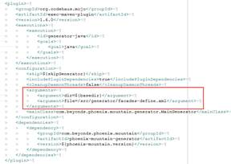
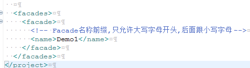

# **项目开发文档**

## Ø  创建新项目

### 本地环境搭建

JDK1.8+

Maven3.5+

Ant1.9+

安装完毕后，配置环境变量。

### 项目信息配置

编辑根目录下的build.properties文件，其中：

projectName：项目名称

projectCompany：公司名称

projectScope：项目所属模块

projectVersion：项目版本

除了版本之外，其他字段均要求小写

### 项目生成

两种方式：

1， （Windows环境）进入项目根目录，双击setup.cmd；

2， 进入项目根目录，在控制台执行命令：ant

### 项目导入

1， 进入根目录/projects，找到生成的对应项目，项目名称是

{projectScope}-{projectName}-platform.git

2， 把项目拷贝到开发目录，导入到开发工具中即可

 

## Ø  项目说明

### 项目基本信息

1，该项目基于JDK 1.8+、SpringBoot 2.1.0.RELEASE、SpringCloud Finchley.SR2，Spring-WebMvc框架；

2，数据库采用MySql，驱动mysql-connector版本是8.0.13，默认支持数据库主从和负载配置，默认支持c3p0 0.9.5.2版本；

3，默认配置支持github统一配置和本地配置；

4，默认配置支持FeignClient配置，支持熔断降级机制；

5，默认配置支持统一注册中心；

6，默认配置支持tomcat 9.0.12，支持异步响应；

7，默认配置支持jedis 2.9.0；

8，默认配置支持kafka 2.2.0.RELEASE；

9，默认配置支持ElasticSearch 5.6.10；

### 项目直接支持功能

1， 默认配置支持logback日志系统，支持调用链路节点性能响应追踪，支持traceId埋点；

2， 默认配置支持Swagger 2.9.2，支持生成离线pdf和html文档；

3， 默认配置支持输入参数日期类型为字符串格式日期：

yyyy-MM-dd HH:mm:ss

yyyy-MM-dd HH:mm

yyyy-MM-dd HH

yyyy-MM-dd

int类型数字

long类型数字

输出日期格式默认是yyyy-MM-dd HH:mm:ss字符串；

4， 默认配置支持validator框架；

5， 支持自动生成controller、service层代码，支持生成domain层框架代码；

6， 默认多线程开发；

7， 默认支持数据库统一事务；

### 项目框架结构

1， 接口定义层：

Façade层，需要按照标准Spring WebMvc配置，比如@RequestMapping等；

2， 接口实现层：

Controller层，Façade层的实现层，可由generator框架自动生成；

3， 服务接口层：

Service层和Service实现层，可由generator框架自动生成；

4， 业务层：

Domain层，具体实现业务层，可由generator框架自动生成类框架，再由开发人员写入具体实现代码。

该相关类由3个方法组成：

executeCheck()：作为事务前参数校验和简单业务逻辑校验，无事务控制；

executeAction()：作为事务中的业务逻辑处理，有事务控制；

executeAfter()：作为事务后期附加业务处理，比如完善返回结果、发送消息、更新缓存等；

5， 数据中间层：

DomainRepository层，主要是对Dao层的封装，做些简单的数据转换处理；

6， 数据库：

Dao层：MyBatis的接口定义层，也可做简单的接口注解实现；

Xml层：MyBatis的xml实现层，具体的数据库业务逻辑实现层。

7， Po层：

实体数据定义层，与表结构映射；

8， Model层：

业务数据定义层，与输出数据结构映射。

## Ø  引入Mountain框架

1， mountain-core

主要提供核心工具包和基础服务

2， mountain-shackle

主要是统一事务框架和线程安全框架

3， mountain-generator

主要是代码自动生成框架

4， Shackel的使用(框架已经集成，无需修改)

4.1，在主方法Main添加注解

@EnableShackleTemplates(basePackages = {"com.beyonds.phoenix.demo.service"})

4.2，在Service接口文件上添加注解

@ShackleTemplate(name = "demoService")

4.3，在Service定义方法上添加注解

@ShackleDomain(value = "insertDemo", domain = DemoInsertDomain.class, domainName = "demoInsertDomain", withTrans = true)

如果需要，可以手动更新配置，支持多数据源事务配置。

## Ø  自动生成代码

1， 配置maven组件

主pom有如下代码片段

这里无需修改，找到对应的/src/generator/facades-define.xml即可；

在facades-define.xml找到代码片段：

在这里添加对应的<facade>xxxxx</facade>，其中xxxx是Façade类对应的前缀，最终生成的类名是XxxxFacade

2， 编写规范的Façade接口定义文件

按照标准Spring WebMvc编写代码即可；

如果有需要，可以借助注解设置一些附件信息

Facade文件类上可以添加注解

@FacadeConfig(name = "Demo1", description = "Demo1Facade接口定义", execGenerator = true, useSwagger = false, reGenerator = false)

其中，name与<facade>配置中的name一致；

​      description是接口说明，用于生成swagger说明；

​      execGenerator表明是否重新生成该类对应的后续相关文件；

​      useSwagger表明是否生成swagger；

​      reGenerator表明是否重新生成该Facade文件。

Façade文件方法上可以添加注解

@MethodConfig(name = "queryBy", description = "queryBy方法定义说明", listResultFlag = true, paginationFlag = true, withTransaction = false)

其中，name是方法名称；

​      description是方法说明，用于生成swagger上的说明；

​      listResultFlag表明该方法的结果是否是list列表；

​      paginationFlag表明该方法的结果list列表是否分页；

​      withTransaction表明该方法对应的业务逻辑是否需要启用事务。

3， 编译Façade文件生成对应的jar文件

执行maven命令 mvn clean install -DskipGenerator=false

4， 执行代码生成工具

执行maven命令 mvn clean exec:java -DskipGenerator=false

刷新项目，即可看到新生成的代码，然后只需要找到domain层编写业务逻辑代码即可。

## Ø  开发数据库端代码

数据库端是由MyBatis支持，可由其generator来自动生成代码，本框架不再做过多介入。

## Ø  开发业务代码

业务端代码主要是在domain层，找到XxxxYyyyDomain，分别实现executeCheck()、executeAction()和executeAfter()即可。

 